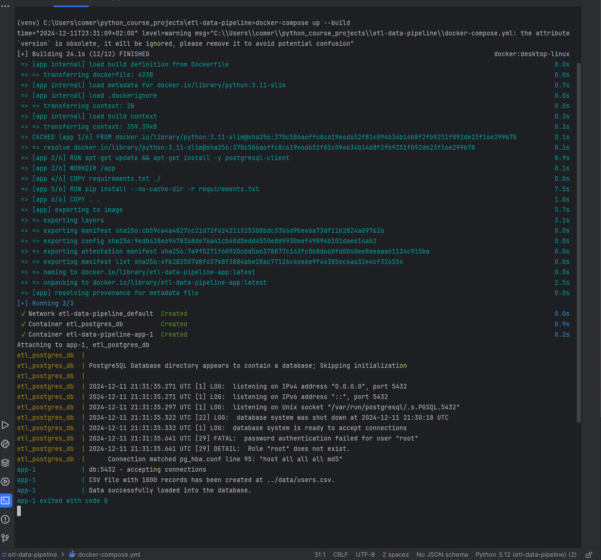

# ETL Data Pipeline


## Description:
ETL Data Pipeline: A Python-based ETL pipeline to extract data from a CSV, transform it (validate emails, format dates, extract domains), and load it into a PostgreSQL database. Includes Docker setup and SQL query scripts for analysis.


## Technologies used:
In this project, I used the following technologies:

- Python
- SQL
- PostgreSQL
- Docker


## Main features:
- **Data Extraction:**
  Reads data from a CSV file with over 1000 records, including user_id, name, email, and signup_date.
---

- **Data Transformation:**
  - Validates and standardizes signup_date to YYYY-MM-DD.
  - Filters out invalid email addresses.
  - Extracts email domains and adds them as a new column.
---

- **Data Loading:**
  Creates and populates a PostgreSQL table with transformed data.
---

- **SQL Analysis:**
  Provides pre-written SQL scripts for tasks like counting users by signup date and finding the most common email domain.
---


## Installation and Commands
1. Clone the repository:
    ```bash
    git clone https://github.com/Illya-Maznitskiy/etl-data-pipeline.git
    ```
2. Navigate to the project directory:
    ```bash
    cd etl-data-pipeline
    ```
3. Build and run Docker containers (it will automatically create PostgreSQL database and load data there):
    ```bash
    docker-compose up --build
    ```
4. Run the SQL queries (you can choose different SQL queries, like query2.sql or query3.sql in the command):
    ```bash
    docker exec -it etl_postgres_db psql -U myuser -d mydb -f /queries/query1.sql
    ```
5. Check the db data:
    ```bash
   docker exec -it etl_postgres_db psql -U myuser -d mydb -c "SELECT * FROM users;"
    ```


## Screenshots
### Build and run Docker containers with creating data in DB


### Check the data in DB with Docker


### Create SQL queries

